# Getting started

## Qualtrics

The following instructions will show you how to embed the InteroMap tool in a
Qualtrics survey. You need to repeat these steps for every question in which 
you wish to use InteroMap.

Here is an overview of the procedure:

1. Create a block containing the InteroMap tool preloaded with the _Female_ 
   persona.
2. Create another block with the InteroMap tool preloaded with the _Male_ 
   persona.
3. Create a question inviting the user to choose a persona.
4. Program your survey to receive data from the InteroMap tool and save it in 
   Qualtrics.

Note: If you use InteroMap multiple times in your survey (e.g. for different 
questions), you must choose a unique variable name which will hold the 
InteroMap data for each question separately. In the steps below, we use the 
variable `question1data` as an example to hold the data of the first question. 
If we have another question, say question 4, which uses InteroMap too, we must 
use another variable that we could name `question4data` for example.

### Steps

1. Add a new block to your survey by clicking on **Add Block** and to name it 
_InteroMap Female_.

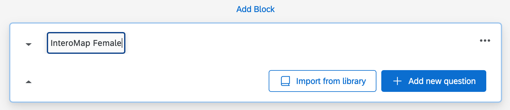

2. Inside this block, click on **Add new question** and select 
**Text / Graphic**

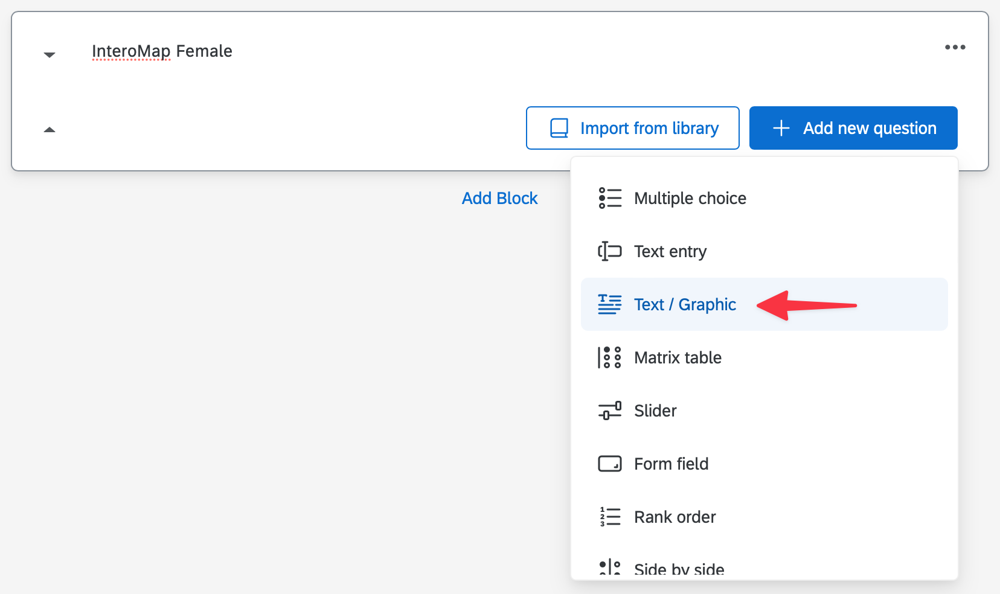

3. A new question will appear inside the block. When you hover it, its 
background becomes gray. Click on it to enable the question toolbar.

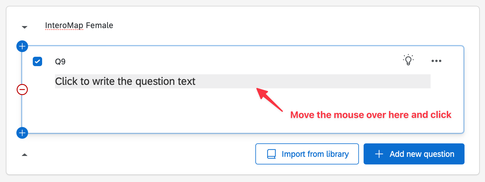

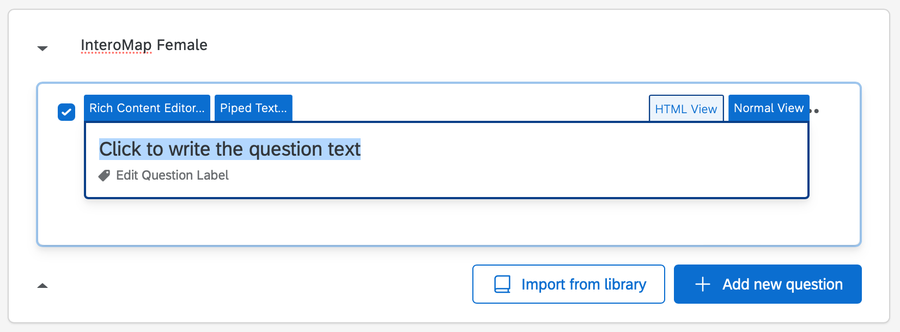

4. Click on the **HTML View** tab. You should now be able to insert HTML code.

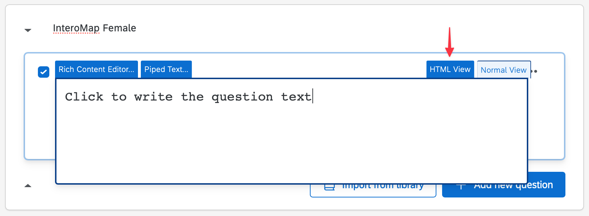

5. Insert the following HTML code to embed the InteroMap tool with the 
pre-selected _female_ persona and the `question1data` variable.

```html
<iframe id="interomap_tool" src="https://interomap.github.io/interomap-dist/?persona=female" style="width: 100%; height: 70vh;" title="InteroMap Tool - Female"></iframe>
```

6. Click outside the text area to select the question panel.

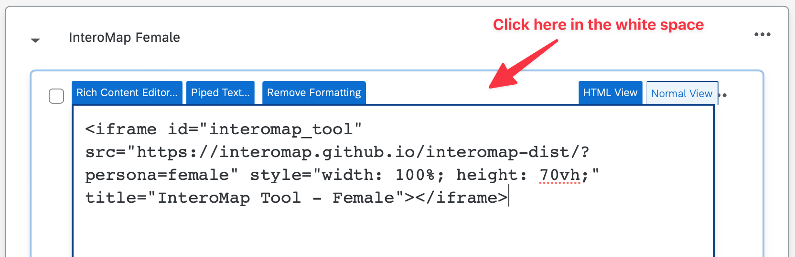

7. The InteroMap tool should now appear inside the question. On the left, at 
the bottom of the _Edit question_ panel, click on **JavaScript**.

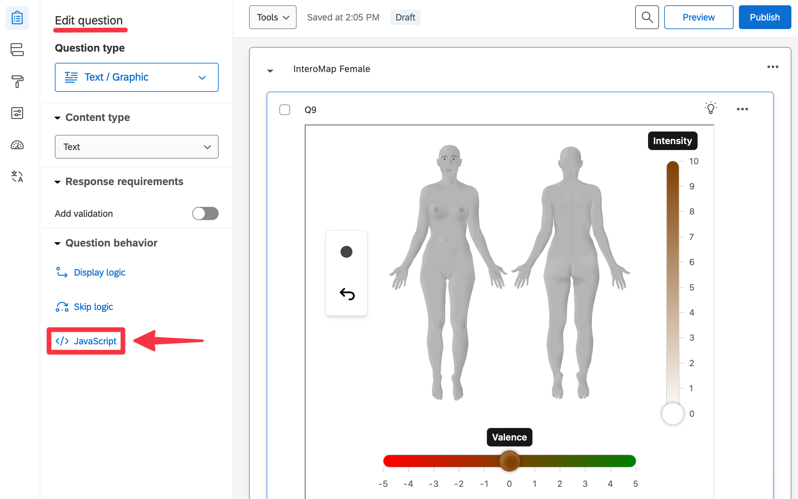

8. A new popup named _Edit Question JavaScript_ appears. Copy the following 
code inside it, replacing the default content.

```javascript
Qualtrics.SurveyEngine.addOnReady(function()
{
	window.addEventListener('message', function(event) {
		if (event.data.event === "interomap_data") {
			Qualtrics.SurveyEngine.setEmbeddedData("question1data", event.data.output);
		}
	})
});
```

Note: Replace `question1data` with your variable name for this question.

It should look like this:

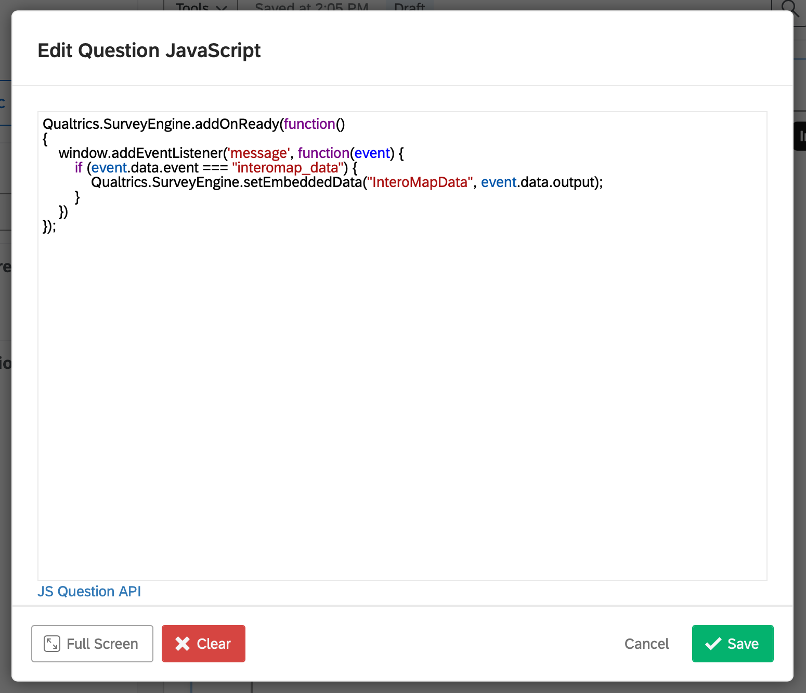

Click on **Save**.

9. Repeat the steps 1 to 8 for another block named _InteroMap Male_. At step 5, 
use the following HTML code instead:

```html
<iframe id="interomap_tool" src="https://interomap.github.io/interomap-dist/?persona=male" style="width: 100%; height: 70vh;" title="InteroMap Tool - Male"></iframe>
```

Use the same JavaScript code as in step 8 here.

10. To create the question inviting the user to choose a persona, create a new 
block and a new question inside it. Move this new block _before_ the ones 
containing the InteroMap tool. Design it to your liking. Here is an example :

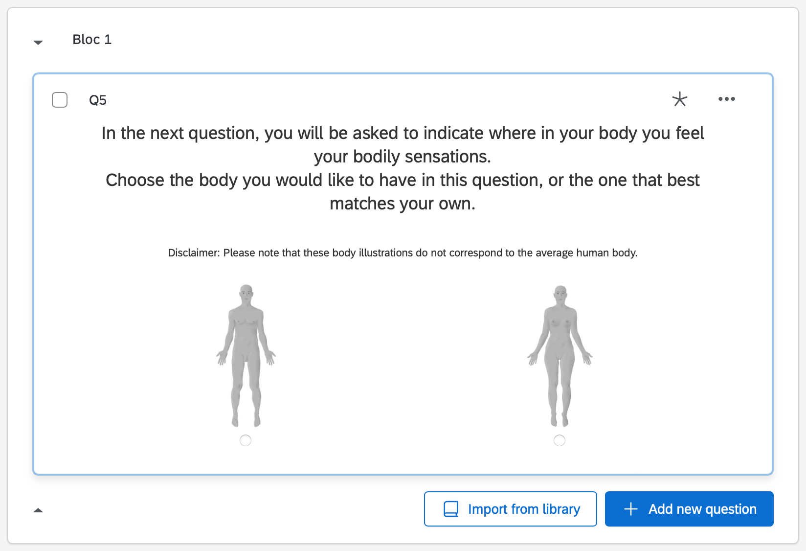

11. Open the block menu in the upper right corner and select 
**View block in survey flow**

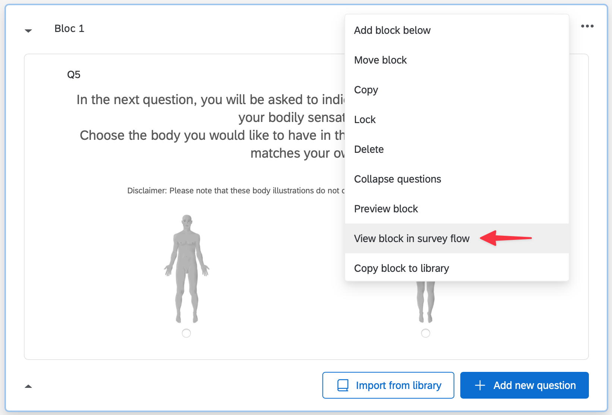

12. Create the following flow.

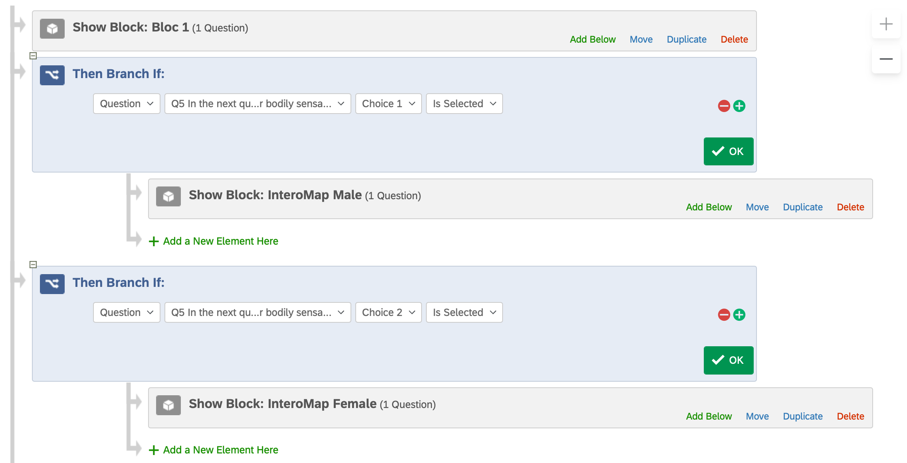

13. While you're in the _Survey flow_ page, at the bottom of the flow, click on 
**Add a New Element Here**. A new panel appears, click on **Embedded Data**.

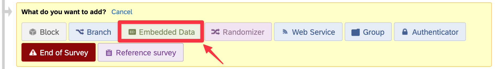

14. Click on **Create New Field or Choose From Dropdown...** and type 
your variable name for this question (`question1data` in our example). Click on 
**Apply** to save your changes.

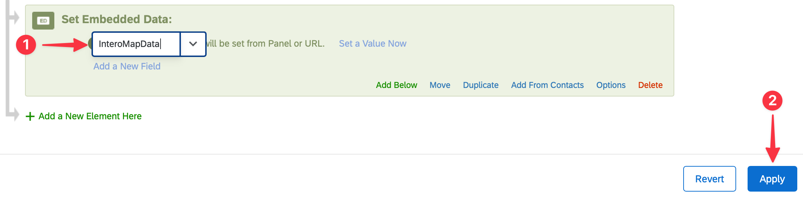

Repeat this step as many times as you have questions using InteroMap. For example, 
if you are using InteroMap in 3 questions, you should create 3 distinct variables.

:tada: You are done embedding the InteroMap tool in your survey.
